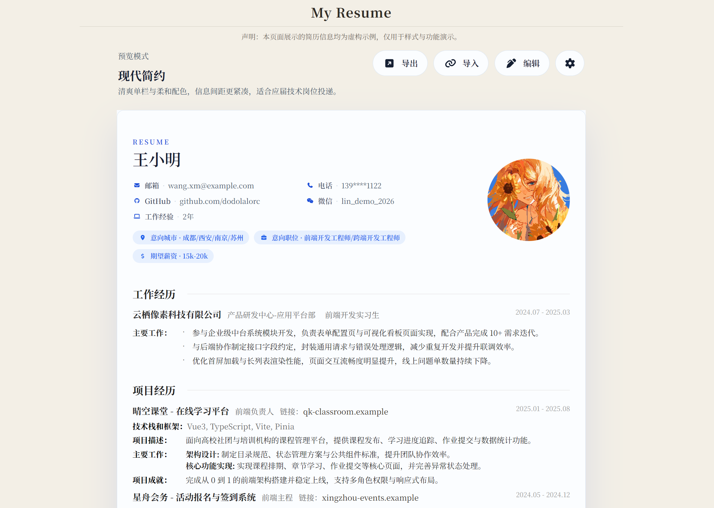
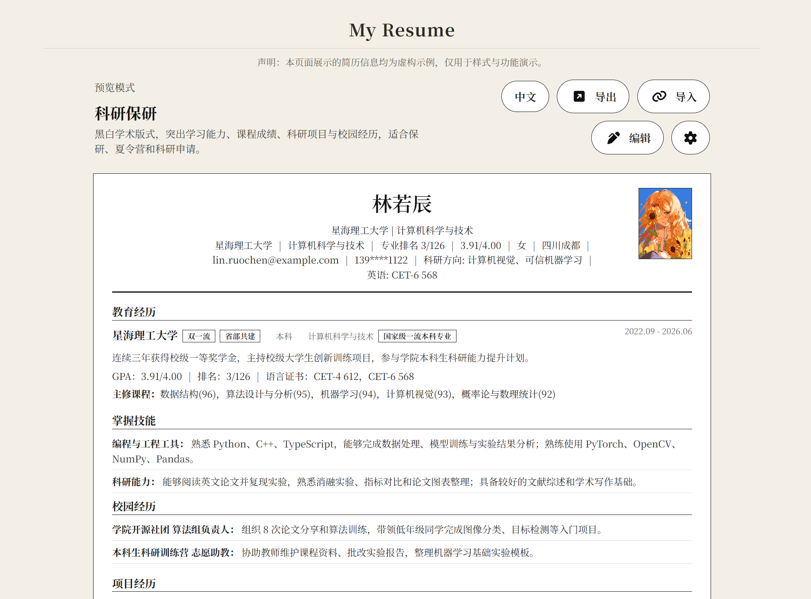
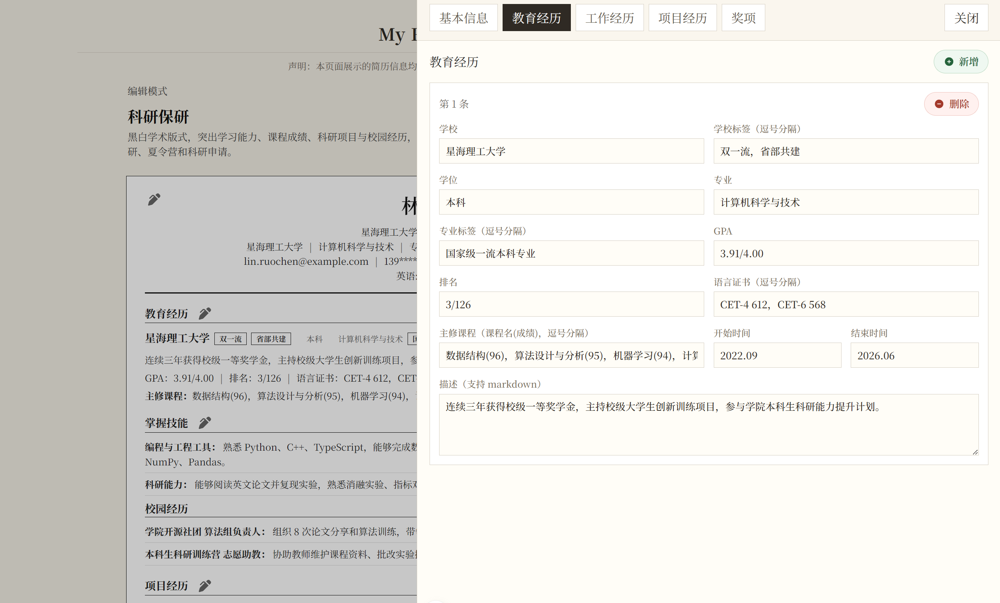

# Resume Builder - 在线简历生成器

一个基于 Vue 3 + TypeScript 构建的在线简历填写与生成工具。无需注册，打开即用，支持可视化编辑、主题切换、多语言内容、JSON 导入导出，以及浏览器原生 PDF 打印导出。





> 在线体验：[resume.dodolalorc.cn](https://resume.dodolalorc.cn)  
> 项目仓库：[github.com/dodolalorc/resume.dodolalorc.cn](https://github.com/dodolalorc/resume.dodolalorc.cn)

## 功能概览

- 可视化编辑：支持个人信息、教育经历、工作/校园经历、项目经历、奖项等模块。
- 主题系统：内置求职和科研两类主题，支持实时切换。
- 科研保研主题：黑白学术排版，突出 GPA、排名、课程成绩、语言证书、科研项目、技能与校园经历。
- 多语言内容：简历正文支持中文/英文切换，数据字段兼容字符串和 `{ zh, en }` 结构。
- 教育标签：学校和专业支持多个标签，例如 `985`、`211`、`双一流`、`QS Top 100`。
- PDF 导出优化：支持自定义 PDF 文件名，多页时自动补齐末页背景，并在多页右下角显示 `1/2`、`2/2` 页码。
- 数据导入导出：支持 JSON 备份、恢复和迁移；HTML 可离线查看。

## 编辑能力

| 模块 | 主要字段 |
| --- | --- |
| 个人信息 | 姓名、邮箱、电话、微信、头像、GitHub、博客、求职意向、科研申请信息、GPA、排名、籍贯、自定义科研信息 |
| 教育经历 | 学校、学位、专业、学校标签、专业标签、GPA、排名、语言证书、主修课程、起止时间、描述 |
| 工作/校园经历 | 公司、部门、职位、起止时间、经历类型、科研技能标题、内容列表 |
| 项目经历 | 项目名称、角色、作者排名、会议/期刊/项目来源、状态、时间、技术栈、项目描述、主要工作、项目成果 |
| 奖项 | 奖项名称、颁发机构、等级、类别、时间 |

编辑抽屉支持点击遮罩关闭，模块导航使用中文名称；新增、删除等操作按钮统一使用图标和颜色区分。

## 主题

主题配置位于 `src/themes/presets/`，由 `src/themes/index.ts` 自动注册。

| 主题 | 面向场景 | 说明 |
| --- | --- | --- |
| 科研保研 | 保研、夏令营、科研助理、学术申请 | 黑白严谨版式，突出学习能力和科研训练 |
| 简约纸张 | 校招、应届生、研究型经历 | 白纸化单栏结构，信息密度均衡 |
| 稳重专业 | 技术岗位、研发岗位 | 克制单栏专业排版，层级清晰 |
| 现代简约 | 应届开发、前端、全栈 | 现代单栏样式，适合技术投递 |
| 技术导向 | 工程项目突出型简历 | 强化项目和技能表达 |

新增主题可以运行：

```bash
bun run theme:new -- My Theme
```

## 数据结构

默认数据位于 `src/data/cv.json`。文本字段既可以使用普通字符串，也可以使用多语言对象：

```json
{
  "name": {
    "zh": "林若辰",
    "en": "Ruochen Lin"
  }
}
```

科研主题示例字段：

```json
{
  "profile": {
    "school": "星海理工大学",
    "major": "计算机科学与技术",
    "ranking": "专业排名 3/126",
    "gpa": "3.91/4.00",
    "researchInfo": [
      { "label": "科研方向", "value": "计算机视觉、可信机器学习" }
    ]
  },
  "education": [
    {
      "schoolTags": ["双一流"],
      "languageCertificates": ["CET-4 612", "CET-6 568"],
      "courses": [
        { "name": "数据结构", "grade": "96" },
        { "name": "机器学习", "grade": "94" }
      ]
    }
  ],
  "projects": [
    {
      "name": "复杂光照条件下的校园道路目标检测研究",
      "authorRank": "第二作者",
      "venue": "CCF-C 类会议在投",
      "status": "投稿中"
    }
  ]
}
```

## 导出

| 格式 | 说明 |
| --- | --- |
| PDF | 使用浏览器原生打印。导出前可输入文件名，打印保存为 PDF；多页时自动补齐背景并显示页码 |
| HTML | 生成独立 HTML 文件，内联样式，可离线查看 |
| JSON | 导出当前简历数据，用于备份、迁移和再次导入 |

PDF 导出使用 `@page` 和 `window.print()`，不依赖 canvas 截图，适合保留可选择文本和浏览器打印能力。

## 快速开始

### 环境要求

- Node.js >= 18
- Bun >= 1.0

### 安装与运行

```bash
bun install
bun dev
```

浏览器打开 `http://localhost:5173`。

### 常用命令

```bash
bun dev             # 启动开发服务
bun run build       # 类型检查并构建
bun run build-only  # 仅构建生产版本
bun run type-check  # TypeScript 类型检查
bun test:unit       # 运行单元测试
bun run theme:new -- My Theme
```

## 项目结构

```text
src/
├─ assets/icons/              # SVG 图标
├─ components/                # 通用组件
├─ data/cv.json               # 默认简历数据
├─ i18n/                      # 国际化文案
├─ themes/
│  ├─ index.ts                # 主题加载与样式变量构建
│  ├─ types.ts                # 主题类型
│  └─ presets/                # 主题预设
├─ types/resume.ts            # 简历数据类型
├─ utils/
│  ├─ localized.ts            # 多语言字段工具
│  └─ resume-export.ts        # PDF / HTML 导出工具
└─ views/
   ├─ resume-view.vue         # 主页面
   ├─ components/             # 展示卡片
   └─ modules/resume-editor/  # 编辑抽屉
```

## 技术栈

| 类型 | 技术 |
| --- | --- |
| 框架 | Vue 3.5 + Composition API |
| 语言 | TypeScript |
| 构建 | Vite |
| 状态 | Pinia |
| 路由 | Vue Router |
| 样式 | TailwindCSS + 组件内 CSS |
| 国际化 | vue-i18n |
| 包管理 | Bun |

## 部署

推荐部署到 Vercel。仓库已提供 `vercel.json`，默认输出目录为 `dist`。

## 开发记录

本次功能更新重点：

- 新增科研保研主题和科研导向默认数据。
- 扩展简历数据模型，支持科研申请字段和中英内容。
- 优化编辑抽屉交互、按钮样式和模块中文命名。
- 优化 PDF 导出体验，修复多页背景与页码展示问题。

## License

MIT License
